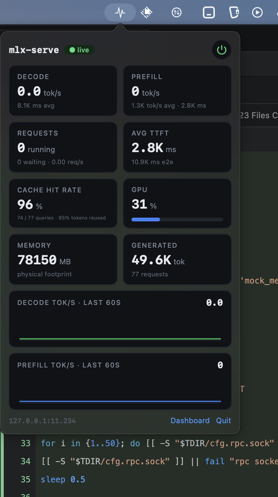
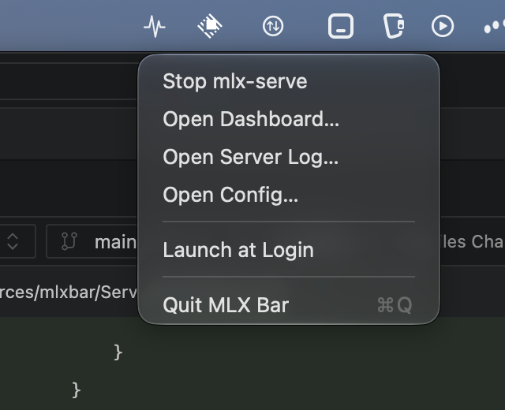

# mlx-serve-bar

A tiny macOS menu-bar app to start, stop, and monitor an [MLX](https://github.com/ml-explore/mlx) inference server (`mlx-serve` / `mlx_lm.server`-style API) without leaving the menu bar.

No dock icon, no notifications, no window chrome — one template icon in the menu bar:

- **Click the icon** → popover with live stats, power button, Dashboard/Quit links
- **Right-click the icon** → Start/Stop, Open Dashboard, Open Server Log, Open Config, Launch at Login, Quit
- **Nothing else.** No hover zones, no proximity magic — the panel only opens when you actually press the icon.





## What it shows

Every metric, label, formula, and color is a faithful port of the **mlx-serve dashboard's own metrics panel** (the embedded JS in its index page), so the menu-bar popover and the browser dashboard always agree:

| Tile | Source (per dashboard tick) |
|---|---|
| Decode tok/s | `generation_tokens_live` delta over a trailing 4 s window, while `requests_running > 0`; 0 when idle — live speed, never counter averages |
| Prefill tok/s | `prefill_tokens_live` delta over a trailing 30 s window while prefilling; 0 otherwise |
| Prefill sub | `prefill_tokens_total ÷ prefill_time_seconds.sum` (forwarded tokens, never billed tokens), or `prefilling · N tok` while a prefill chunk lands |
| Requests | `requests_running`, sub `N waiting · r.rr req/s` over a 60 s window |
| Avg TTFT | `time_to_first_token_seconds.sum ÷ count`, sub `e2e_request_latency_seconds` average |
| Cache hit rate | `prefix_cache_hits_total ÷ prefix_cache_queries_total`, sub `h / q queries · r% tokens reused` (prefix-cache tokens ÷ prompt tokens) |
| GPU | `gpu_utilization_pct` with a bar: `#3b82f6`, `#f59e0b` ≥ 70, `#ef4444` ≥ 90 |
| Memory | `memory_mb` physical footprint |
| Generated | live generation gauge (moves mid-request), sub `N requests` |
| Sparklines | last 60 ticks (1 s poll), auto-scaled, decode `#22c55e`, prefill `#3b82f6` |

All rates are re-derived from the current feed on every tick — nothing is carried between ticks, no smoothing, no EMA. Numbers are formatted with the dashboard's own `fmt()` (≥1 M → `x.xM`, ≥1 K → `x.xK`, else fixed decimals).

The app polls `/metrics.json` every 1 s (like the dashboard); if metrics fail but `/health` answers, it freezes the last frame instead of showing zeros. A server restart (detected by counter regression) clears the rate windows, exactly like reloading the dashboard page.

## Requirements

- macOS 14+ on Apple Silicon
- An MLX inference server exposing `/health` and `/metrics.json` (the mlx-serve dashboard server)
- Xcode command line tools (Swift 5.9+) to build

## Install

```sh
git clone https://github.com/2mawi2/mlx-serve-bar
cd mlx-serve-bar
./build.sh --install    # build + selftest + bundle + copy to ~/Applications + launch
```

Then right-click the waveform icon → **Launch at Login** if you want it permanent.

## Configuration

On first launch the app scans running processes for a `mlx-serve`-style server, adopts its arguments, and writes `~/Library/Application Support/MLXBar/config.json`:

```json
{
  "bin": "/Users/you/.local/bin/mlx-serve-start",
  "args": [],
  "host": "127.0.0.1",
  "port": 11234
}
```

- `bin` + `args` are what the power button (or `ctl start`) launches; point `bin` at your start wrapper so safety checks (port guards, model verification) still run.
- Server stdout/stderr goes to `~/Library/Logs/MLXBar/server.log` (menu → Open Server Log).
- The app itself is `LSUIElement`: never in the Dock, never steals focus.

## Scripting (`ctl`)

The running app exposes a tiny unix-socket RPC (socket next to the config file):

```sh
mlx-bar ctl [--config <path>] status   # JSON: state, pid, live metrics
mlx-bar ctl ping | start | stop | quit
mlx-bar ctl rect | panel | events      # diagnostics (icon rect, panel visible, UI event log)
```

`ctl` is what the bundled `tools/lifecycle_test.sh` drives.

## Development

```sh
swift build
.build/release/mlxbar --selftest     # 27 checks: rate math, parser, formatting
./tools/lifecycle_test.sh            # full lifecycle against a mock server (never touches yours)
./build.sh                           # bundle dist/MLXBar.app
./build.sh --install                 # + copy to ~/Applications and relaunch
```

Layout:

```
Sources/mlxbar/
  main.swift            entry point: --selftest | ctl | GUI
  Config.swift          config file, process discovery, shell-out helpers
  Metrics.swift         the dashboard rate math ported 1:1 + JSON parser + 1 s poller
  Formats.swift         dashboard fmt()/rounding port
  ServerController.swift spawn/terminate/external-detect + ctl status JSON
  StatusController.swift status item, popover, menu, click handling
  DashboardView.swift   SwiftUI tiles/sparklines with the dashboard CSS palette
  LoginItem.swift, RPC.swift, SelfTest.swift
build.sh, tools/        bundling, mock server, lifecycle test, CGEvent click helper
```

## License

MIT — see [LICENSE](LICENSE).
